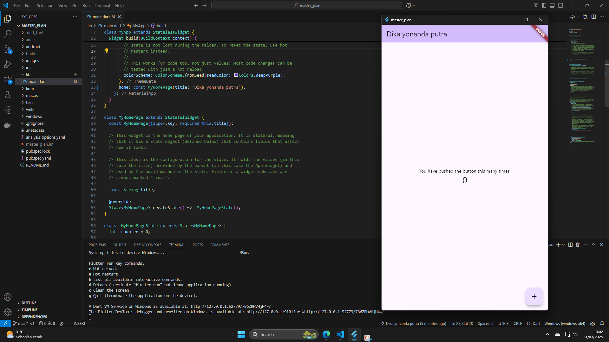
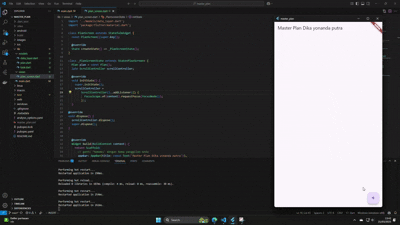
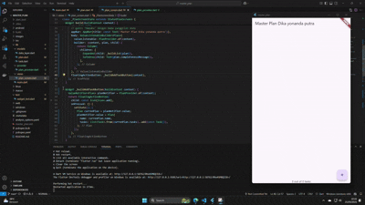
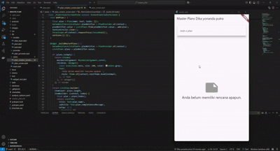

# hello_world

### praktikum 1, soal 1

aplikasi dapat menambahkan teks dengan menekan tombol +, bisa di centang, dan bisa di scroll jika item tidak muat di layar

### praktikum 2, soal 1

sama seperti praktikum 1, tapi kode lebih rapih dan benar

### praktikum 3, soal 1

aplikasi dapat membuat plan yang di dalamnya terdapat plan yang lebih detail yang bisa di centang
